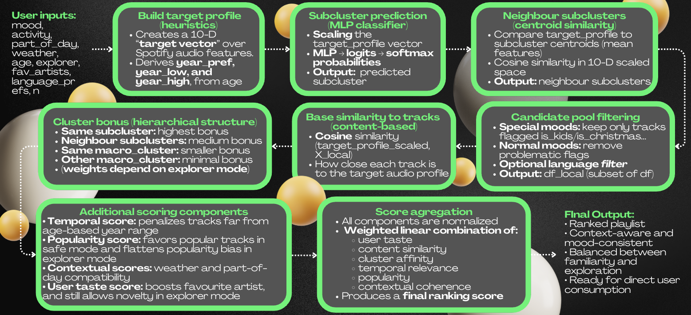

# 🎧 Music Mood Recommender
**Accademic Project for FDS (2025), Data science (Sapienza, University of Rome.)**  
**A hybrid ML-based system for mood-aware, context-aware music playlist generation.**

## 🤖 TRY THE TELEGRAM BOT HERE !!!
- Calliope: https://t.me/MoodyMuse_bot

---

## 🔗 Overview

**Music Mood Recommender** is an intelligent system that generates personalized playlists by combining:

- User **mood**
- **Activity**
- **Time of day**
- **Weather**
- **Age-based temporal preference modeling**
- **Favourite artists**
- **Preferred languages** (multi-selection)
- **Exploration mode** (discover new artists vs. familiar music)

The system integrates:

- **Unsupervised clustering** (UMAP → HDBSCAN → K-Means)  
- **Deep Learning** (MLP classifier for subcluster prediction)  
- **Hybrid scoring recommender system**  
- **Telegram Bot interface**

---

## 📦 Dataset Source
The dataset was downloaded from Kaggle, and it contains the following Spotify numerical audio features:

| Feature            | Meaning                                                |
|--------------------|--------------------------------------------------------|
| `acousticness`     | Likelihood of being acoustic                           |
| `danceability`     | Suitability for dancing                                |
| `energy`           | Perceived intensity                                    |
| `instrumentalness` | Probability of instrumental track                      |
| `liveness`         | Presence of live performance                           |
| `loudness`         | dBFS measurement                                       |
| `speechiness`      | Spoken-word dominance                                  |
| `tempo`            | Beats per minute                                       |
| `valence`          | Musical positivity                                     |
| `duration_ms`      | Track duration                                         |

**Link:** https://www.kaggle.com/datasets/ektanegi/spotifydata-19212020/code

---

## 🧠 System Architecture


## 📁 Repository Structure
Music_Mood_recommender/
- bot/                      # Bot engine.
- data/processed/           # Saving processed data, for bot functioning.
- models/                   # Saving trained MLP model, for bot functioning.
- notebooks/                # Project workflow
- recommender_05.py         # Recommendation system.
- Spotify_API.py            # bot for saving the generated playlist on your spotify-account's library (limit of 25 users only allowed)                                  # This second bot works 24/7 via cloud server (doesn't need deploying).

## 💻📱 How to run and use Music-Mood recommender?

You can use this project in **three** ways:

1. Directly via the **Telegram bot**: https://t.me/MoodyMuse_bot
2. Running the **Telegram bot locally** from this repo
3. Using the **recommender as a standalone Python function**

-------------------------------------------------------

### 1. Use the Telegram bot on Telegram

If the bot is already deployed by the owners, you can simply:

1. Open **Telegram**
2. Search for the bot by its username: `@MoodyMuse_bot`
3. Start a chat and type `/start`
4. Follow the guided questions (mood, activity, weather, etc.) and receive your playlist 🎧

-------------------------------------------------------

### 2. Run the Telegram bot locally

If you want to run the bot from this repository:

1. **Clone the repository** and move into the project folder:
    ```bash
    git clone https://github.com/vita12liano/Music_Mood_recomender.git
    cd Music_Mood_recomender
2. **Create and activate a virtual environment** (optional but recommended):
   ```bash
   python -m venv .venv
    source .venv/bin/activate      # macOS / Linux
    .venv\Scripts\activate       # Windows (PowerShell / CMD)
4. **Install dependecies**:
   ```bash
   pip install -r requirements.txt
6. **Create your ".env" file, and insert your Telegram-bot's Token**:
   ```bash
    TELEGRAM_BOT_TOKEN=YOUR_TELEGRAM_BOT_TOKEN_HERE
8. **Make sure the data and model files are in place**:
	- data/processed/spotify_dataset_clustered.csv
 	- models/mlp_subcluster.pth
	- models/scaler_mean.npy
	- models/scaler_scale.npy
	- models/label_encoder_classes.npy
9. **Run the "telegram_bot.py" file**:
    ```bash
    python telegram_bot.py

-------------------------------------------------------

## 3. Use the recommender as a standalone Python module

You can also bypass Telegram entirely and call the recommender directly from Python.

Make sure you are in the project root and your environment is set up (data + models as in option 2. Run the Telegram bot locally), then:
    
	from recommender_05 import recommend_playlist
	
    playlist = recommend_playlist(
        mood="happy",
        activity="party",
        part_of_day="evening",
        weather="sunny",
        age=23,
        explorer=True,              # True = more exploration, False = safer / more popular
        n=20,                       # number of recommended tracks
        fav_artists=["Avicii"],     # optional list of favourite artists
        language_prefs=["en"]       # optional list of language codes (e.g. ["en", "it"])
    )
    print(playlist.head())

## 📚 References

### Features Analisys:
- Panda, R., Redinho, H., Gonçalves, C., Malheiro, R., & Paiva, R. P. (2021, July). ***How does the spotify api compare to the music emotion recognition state-of-the-art?.*** In Proceedings of the 18th sound and music computing conference (smc 2021) (pp. 238-245). Axea sas/SMC Network.
- Duman D, Neto P, Mavrolampados A, Toiviainen P, Luck G (2022). ***Music we move to: Spotify audio features and reasons for listening.*** PLoS ONE 17(9): e0275228.
### Clustering & Subclustering:
- Vega-Pons, S., & Ruiz-Shulcloper, J. (2011). ***A survey of clustering ensemble algorithms.*** International Journal of Pattern Recognition and Artificial Intelligence, 25(03), 337-372.
- McInnes, L., Healy, J., & Melville, J. (2018). ***Umap: Uniform manifold approximation and projection for dimension reduction.*** arXiv preprint arXiv:1802.03426.
- McInnes, L., Healy, J., & Astels, S. (2017). ***hdbscan: Hierarchical density based clustering.*** J. Open Source Softw., 2(11), 205.
- De Amorim, R. C., & Mirkin, B. (2012). ***Minkowski metric, feature weighting and anomalous cluster initializing in K-Means clustering.*** Pattern Recognition, 45(3), 1061-1075.
### MLP model usage:
- de Araujo, R. C., Santos, V. M. S., de Oliveira, J. F. L., & Maciel, A. M. ***A Hybrid Music Recommendation System Based on K-Means Clustering and Multilayer Perceptron.*** age, 16, L3R.
- Pons, J., & Serra, X. (2019). ***musicnn: Pre-trained convolutional neural networks for music audio tagging.*** arXiv preprint arXiv:1909.06654.
### Hybrid recommender:
- Schedl, M., Zamani, H., Chen, C. W., Deldjoo, Y., & Elahi, M. (2018). ***Current challenges and visions in music recommender systems research.*** International Journal of Multimedia Information Retrieval, 7(2), 95-116.

## 🧑‍🧑‍🧒‍🧒 Team:
- Vitaliano Barberio
- Debora Siri
- Mirko Impera
### ***Sapienza University of Rome, Data Science — Fundamentals of Data Science (2025)***
